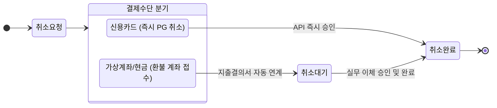

## 📌 프로젝트 배경 및 개요

이커머스 및 B2B 결제 모듈을 구축함에 있어, 신용카드 결제와 **가상계좌(무통장입금) 결제**는 상태 동기화 및 라이프사이클 관리 측면에서 완전히 다른 패러다임을 가집니다. 
신용카드는 즉각적인 승인/취소 처리가 이루어지지만, 가상계좌는 **발급 → 입금 대기 → 입금 확인 → 취소 요청 → 환불 정산(계좌 이체 대기) → 취소 완료**라는 비동기적 상태 상태 체인을 관리해야 합니다.

본 글에서는 가상계좌 발급 및 결제 취소/환불 사이클을 구현하면서 겪은 **아키텍처 설계 고민과 예외 처리(망취소 로직) 트러블슈팅 과정**을 기술합니다.

---

## 📐 1. 가상계좌 발급 및 UI/UX 로직 설계

### 🤔 ISSUE: 결제 정보 입력 창 및 콜백 처리 방식 (Modal vs Window Popup)
가상계좌 발급 시 사용자의 인증 정보 및 결제 금액(공급가액 + 부가세 + 봉사료)을 PG사로 전송하고, 반환된 가상계좌 정보를 사용자 화면에 즉각 렌더링해야 했습니다.

*   **방안 A (Modal 방식):** `returnUrl` 호출 후 현재 화면 위에 모달 창을 동적으로 생성해 계좌 정보를 표시
    *   *문제점:* 모바일/태블릿 웹뷰 및 특정 브라우저 환경에서 PG사 리다이렉션 시 IFrame 보안 제약(Cross-Origin) 및 세션 단절로 인한 렌더링 불안정 현상 발생
*   **방안 B (Window Popup 방식 [선택 🌟]):** 별도의 윈도우 팝업을 호출해 결제 정보를 승인받고, `returnUrl` 콜백이 도달하면 메인 윈도우로 가상계좌 파라미터를 파싱하여 뷰를 완성
    *   *해결 로직:* 팝업 및 부모 창 간의 간섭을 차단하고, 7일 이내 미입금 시 자동 만료 및 재시작 프로토콜이 매끄럽게 연쇄되도록 UI 흐름 확정

---

## 🔄 2. 결제취소 및 비동기 환불 상태 머신(State Machine) 설계

신용카드는 취소 API 호출 시 즉시 `"취소완료(cancelled)"` 상태로 진입하지만, **가상계좌 및 무통장 입금**은 실현금이 이동한 상태이므로 즉각적인 자동 취소가 불가능합니다. 이를 해결하기 위해 결제 수단별 취소 프로세스 정립이 필요했습니다.

### 🛠️ 결제 수단별 취소 상태 분기 로직
1. **신용카드 결제 취소:**
   *   PG 취소 API (`/v1/payments/{tid}/cancel`) 호출 → 결과 코드 `0000` 확인 시 DB 상태를 즉시 `"취소완료"`로 UPDATE.
2. **가상계좌/무통장입금/현금 결제 취소:**
   *   **1단계 (`취소대기`):** 사용자의 환불 계좌 정보(은행코드, 계좌번호, 예금주)를 Validation 한 후, 상태를 즉각 취소 완료가 아닌 **`"취소대기"`**로 설정.
   *   **2단계 (사내 ERP 지출결의서 자동 추가):** 환불금 지출을 위해 사내 재무 관리 로직(지출결의서)에 환불 대기 건으로 자동 접수.
   *   **3단계 (`취소완료`):** 실무 관리자가 출금 처리 완료 승인을 누르는 시점에 웹훅(Webhook) 감지로 DB 상태를 최종 **`"취소완료"`** 처리하고 결제 이력(History)에 아카이브.

---

## 🚨 3. 트러블슈팅: 네트워크 단절 대응을 위한 '망취소(Net Cancel)' 자동화

### ❓ 문제 배경 (Phantom Billing 이슈)
결제 혹은 취소 API 요청 도중 클라이언트 ↔ 서버 간 통신 불안정 또는 타임아웃으로 인해, **PG사에서는 승인(돈이 빠져나감)되었으나 우리 DB에는 반영되지 않는 비동기 불합치 문제(Phantom Billing)**를 방지해야 했습니다.

### 🔍 해결 방안
*   API 호출 시 Http Timeout(설정: 5초) 발생 또는 DB Transaction Rollback이 인지되면, 즉각 차단 프로토콜을 발동하고 **PG사 망취소 API (`/v1/payments/netcancel`)를 자동 트리거**하도록 Exception Handler를 재설계했습니다.
*   **망취소 전송 파라미터 표준화:** 상점 거래 고유번호(`orderId`) 및 전송 로그 타임스탬프를 묶어 재전송 보완 로직(Max-Retry: 3) 구축.

---

## 💡 회고 및 학습 요점

*   **API 통합의 본질은 실패 복구 설계(Fault Tolerance):** 단순히 API 명세서의 정상(Positive) 시나리오대로 연동하는 것은 1차원적 개발입니다. 실전 이커머스 아키텍처에서는 결제 끊김, PG 대기 타임아웃, 웹뷰 팝업 억제와 같은 **예외(Exception) 시나리오를 방지하는 페일세이프(Fail-safe) 로직**이 서비스 실뢰성의 핵심임을 체득했습니다.
*   **ERP 연동을 통한 실무 자동화 감각:** 단독 결제 모듈 구현에 그치지 않고, 가상계좌 환불의 `'취소대기'` 상태를 내부 재무팀의 `'지출결의서 자동 접수'` 프로토콜과 결합함으로써 **사내 운영 인적 비용(Operational Overhead)을 극히 감소시키는 사용자 관점 구조**를 구현했습니다.

---
*Reference: 본 문서에 작성된 모든 로직 및 시나리오는 상용화 전 보안 및 사명 무기명 처리를 마친 개인 기술 탐구 기록입니다.*
