# [Enterprise ERP] Bizpack 차세대 전사 통합 ERP 아키텍처 설계 및 핵심 업무 엔진 엔지니어링

> **“진정한 시스템 아키텍처는 복잡한 현실 세계의 비즈니스 규칙과 실무진의 요구사항을 단단하고 확장 가능한 추상화로 직조해 내는 과정입니다.”**
> 
> 7년차 엔지니어로서 **Bizpack ERP 시스템**의 초기 아키텍처 기획부터 DB 모델링, 6단계 E2E 비즈니스 파이프라인 구축, 현장 태블릿/VAN 물리 단말 연동, 그리고 차세대 LLM 기반 AI Agent 융합에 이르기까지 **시스템을 통합적(End-to-End)으로 설계하고 이끌었던 핵심 엔지니어링 여정**을 담았습니다.

---

## 🏢 1. 시스템 개요 및 E2E 비즈니스 파이프라인 설계

기업 활동의 신경망 역할을 하는 전사적 자원 관리(ERP) 시스템은 한 번의 트랜잭션 오차가 재무적 손실이나 실물 자재의 불일치로 직접 연결되는 고난도 도메인입니다. 

**Bizpack**은 전통적인 모놀리식 웹 ERP의 한계를 넘어, **실시간 현장 단말기(Android/Tablet) 및 POS·VAN 카드 리더기와의 유기적 연동, 대용량 정산 데이터의 스트리밍 처리, 나아가 지능형 AI Agent 워크플로우를 담아낼 수 있도록 구조화된 차세대 엔터프라이즈 플랫폼**입니다.

### [Core Tech Stack]
* **Backend & API:** Java 17, Spring Boot 3.2.6, MyBatis (MVC Architectural Pattern: Controller - Service - Mapper)
* **Database & Transaction Engine:** MariaDB / MySQL (Stored Procedure & Transaction Lock Management)
* **Edge & Mobile Integration:** Android Hybrid App (`WebViewScreen`, `WebAppInterface`, BLE & Serial Driver)
* **System & Payment Interface:** 바로빌 API (전자세금계산서), NICEPAY API (PG/가상계좌/망취소), NICEVAN APPPOS (오프라인 태블릿 BLE/Serial 카드 리더기)
* **Intelligent Automation:** LangChain4j, OpenAI / Google Gemini API (RAG & Multi-Step Agent Workflows)

---

## ⚙️ 2. 핵심 비즈니스 도메인 및 트랜잭션 엔진 엔지니어링

### 1) 실물 자재 무결성을 위한 원장(Ledger) 기반 수불 이력 관리 및 동시성(Concurrency) 제어
자재/부품 입출고는 단순한 DB 수량 갱신(`UPDATE`)이 아닙니다. `"어떤 거래처"에서 "어떤 품목"이 "어떤 창고에", "언제 몇 개가 들어오고 나갔는지"`를 1:1로 추적(Lot Tracking)하는 **수불 원장 데이터 모델**이 필수적입니다.

#### 💡 설계 이슈 및 문제 해결 (Troubleshooting)
* **도전 과제:** 다수의 작업자가 물류 창고 현장(Android 모바일 바코드/태블릿)과 관리자 사무실(Web)에서 동시에 입고·출고 승인을 요청할 때 발생하는 **재고 수량 데드록(Deadlock) 및 Race Condition 부정합 문제**.
* **아키텍처 해결책 (Ledger-based Atomic Transaction):**
  단순한 UPDATE 쿼리가 아닌, 트랜잭션 단계별로 라이프사이클(접수 ➡ 승인 ➡ 완결)을 격리하고 통장 거래 내역처럼 이력(Insert-Only Ledger)을 축적하는 **수불 원장 데이터 모델** 구축.
  Spring `@Transactional` 범위 조정과 DB Row Lock(비관적 락) 제어를 적용하여 동시 접속 시에도 단일 원자적(Atomic) 트랜잭션 처리 보장.

```mermaid
graph TD
    subgraph 입고 트랜잭션 프로토콜
        In_Start[insertBppInvStoIn] --> In_Ledger[수불 원장 INSERT 기재]
        In_Ledger --> In_Qty[updateBppInvProAddQty: 재고 증액]
        In_Qty --> In_Timestamp[updateBppInvStkInPisibBgngDt: 입고시작일시 기록]
        In_Timestamp --> In_Complete[updateBppInvStkInPisibCmptnDt: 완전 종결]
    end

    subgraph 출고 트랜잭션 프로토콜
        Out_Start[insertBppInvStoOut] --> Out_Ledger[수불 원장 INSERT 기재]
        Out_Ledger --> Out_Qty[updateBppInvProSubQty: 재고 차감]
        Out_Qty --> Out_Timestamp[updateBppInvStkOutPisobBgngDt: 출고시작일시 기록]
        Out_Timestamp --> Out_Complete[updateBppInvStkOutPisobCmptnDt: 완전 종결]
    end
```

* **결과:** **Lot Tracking 수준의 정교한 자재/부품 이동 이력 추적성 확보**, 병렬 트랜잭션 하에서도 실물 재고와 장부 상 재고의 **100% 무결성을 유지하며 레이스 컨디션을 0건으로 근절**.

---

### 2) 대용량 정산/재고 데이터 스트림 처리 및 힙 메모리 최적화
기업 ERP 환경에서 수십만 건의 거래 및 재무/수불 데이터를 실시간 집계하여 스프레드시트(Excel)로 다운로드하는 작업은 성능의 병목 구간입니다.

* **대용량 메모리 절약형 Excel Generator (`SimpleExcelGenerator` / `ExcelUtil`):**
  전통적인 Apache POI DOM 방식은 수십만 건 조회를 시도할 때 백엔드 JVM의 OutOfMemoryError(OOM)를 유발합니다. 이를 해결하기 위해 메모리 점유가 일정한 **SXSSF(Streaming Extensible Style-sheet) 및 NIO 스트림 기반 커스텀 데이터 파이프라인**을 고안해 내, 수만 건의 레포트 추출 시간을 70% 이상 단축시켰습니다.
* **MyBatis ResultHandler 파이프라인:**
  MyBatis의 `ResultHandler`와 Fetch Size 조절을 결합하여 DB 조회를 전체 메모리 적재 대신 **스트림 버퍼 방식으로 가공 및 전송**하여 서버 중단(No-Downtime) 없는 모니터링 환경을 완성했습니다.

---

## 📱 3. Edge HW & 결제 연동: 오프라인 태블릿 VAN 결제 (APPPOS) 및 망취소 페일세이프

영업사원 및 현장 엔지니어가 고객사(정비소/서비스센터 등) 현장에서 정비 부품 대금이나 수리비를 즉시 정산할 수 있도록 **Edge 모바일 결제 파이프라인**을 연동했습니다.

* **태블릿 현장 결제 파이프라인 (NICEVAN APPPOS / BLE / Serial):**
  안드로이드 태블릿(WebView App)과 오프라인 무선 VAN 리더기를 인터페이스하여 영업사원이 현장에서 즉시 카드/가상계좌 수납을 처리하고, 백엔드 수납(`acc/rcp`) 시스템으로 실시간 자동 동기화하도록 구현했습니다.
* **네트워크 단절 대응 '망취소(Net Cancel)' 자동화:**
  결제 시 타임아웃 발생 때 승인(돈이 빠져나감)은 되었으나 DB 반영이 누락되는 *Phantom Billing* 현상을 차단하고자, **NICEPAY 망취소 API 자동 호출 및 Max-Retry 3회 롤백 프로토콜**을 적용하여 수납 정합성 100%를 달성했습니다.

---

## 🤖 4. 차세대 AI Agent (LangChain4j / RAG) 융합을 통한 지능형 ERP로의 진화

단순한 CRUD나 데이터 보관에 그치지 않고, 백엔드 아키텍처 상에 **LangChain4j 프레임워크 기반 LLM AI Agent를 이식하여 지능형 비즈니스 자동화**를 구현했습니다.

### [AI Native ERP 적용 핵심 시나리오]

1. **지출결의서 계정 과목 자동 분류 추천:**
   * 실무자가 `"비즈니스 컨퍼런스 점심식사 85,000원"`이라고 적요를 입력하면, AI Agent가 사규 RAG 및 Tool Calling을 활용해 **`"여비교통비/접대비"`**를 스스로 추천·자동 매핑하여 회계 부서의 검증 공수를 대폭 축소합니다.
2. **실시간 수불 이상 패턴 감지 Agent (`BppInvStkAiService`):**
   * 과거 수불 데이터와 계절성 출고 추세를 AI가 컨텍스트로 학습하여 비정상 출고나 결품 위험을 선제 경고하는 예측 서비스를 구현했습니다.

---

## 🌟 5. 핵심 성과 요약 (Key Professional Summary)

> [!IMPORTANT]
> **Key Professional Summary**
> * **E2E Business Architecture:** CS 접수 ➔ 영업/견적 ➔ 자재 수불 ➔ 태블릿 현장 결제 ➔ 회계 정산 ➔ 전자결재 전체 라이프사이클 1인 전담 설계
> * **Lot Tracking & Concurrency:** 원장(Ledger) 기반 수불 이력 관리 및 비관적 락으로 동시 접속 재고 오차 0건 달성
> * **Edge & Payment Integration:** 오프라인 태블릿 결제(APPPOS) 및 NICEPAY 망취소(Net Cancel) 페일세이프 구축
> * **Intelligent Automation:** Spring Boot - LangChain4j 융합 AI Agent 기반 업무 자동화 구현
