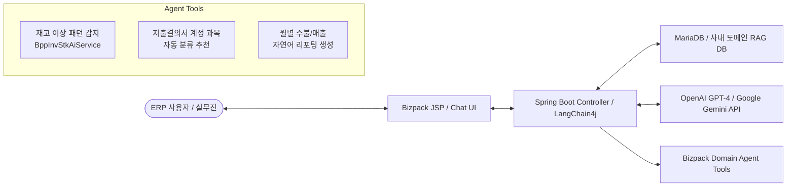

# [Enterprise ERP] Bizpack 전사 통합 ERP 아키텍처 설계 및 핵심 업무 엔진 엔지니어링

> **“진정한 시스템 아키텍처는 복잡한 현실 세계의 비즈니스 규칙과 실무진의 요구사항을 단단하고 확장 가능한 추상화로 직조해 내는 과정입니다.”**
> 
> 7년차 엔지니어로서 **Bizpack ERP 시스템**의 초기 아키텍처 기획부터 데이터베이스 스키마 설계, 핵심 백엔드 도메인 로직, 현장 모바일 단말(Android) 하이브리드 제어, 그리고 차세대 AI Agent 융합에 이르기까지 **시스템을 통합적(End-to-End)으로 설계하고 이끌었던 핵심 엔지니어링 여정**을 담았습니다.

---

## 🏢 1. 시스템 개요 및 아키텍처 설계 배경

기업 활동의 신경망 역할을 하는 전사적 자원 관리(ERP) 시스템은 한 번의 트랜잭션 오차가 재무적 손실이나 실물 재고의 불일치로 직접 연결되는 고난도 도메인입니다. 

**Bizpack**은 전통적인 모놀리식 웹 ERP의 한계를 넘어, **실시간 현장 단말기(Android/Tablet) 및 POS·물리 하드웨어와의 원행(Hybrid) 유기적 연결, 대용량 재무 데이터의 신속한 처리, 나아가 지능형 AI 워크플로우를 담아낼 수 있도록 구조화된 엔터프라이즈 플랫폼**입니다.

### [Core Tech Stack]
*   **Backend & API:** Spring Boot (Java), MyBatis (MVC Architectural Pattern: Controller - Service - Mapper)
*   **Database & Transaction Engine:** MariaDB / MySQL (Stored Procedure & Transaction Lock Management)
*   **Edge & Mobile Integration:** Android Hybrid App (`WebViewScreen`, `WebAppInterface`, BLE & LocationHelper)
*   **Intelligent Automation:** LangChain4j, OpenAI / Google Gemini API (RAG & Multi-Step Workflows)

---

## ⚙️ 2. 핵심 비즈니스 도메인 및 트랜잭션 엔진 엔지니어링

### 1) 실물 재고 무결성을 위한 복합 수불현황(Stock In/Out Ledger) 트랜잭션 모델링
재고자산의 입출고는 단순한 DB 상태 갱신이 아닙니다. `"어떤 거래처"에서 "어떤 품목"이 "어떤 창고에", "언제 몇 개가 들어오고 나갔는지"`를 자동 추적하는 **수불현황 트랜잭션 체계**가 필수적입니다.

#### 💡 설계 이슈 및 문제 해결 (Troubleshooting)
*   **도전 과제:** 다수의 작업자가 물류 창고 현장(Android 모바일 바코드/태블릿)과 관리자 사무실(Web)에서 동시에 입고·출고 승인을 요청할 때 발생하는 **재고 수량 데드록(Deadlock) 및 부정합 문제**.
*   **아키텍처 해결책 (Atomic Ledger Chain):**
    단순한 UPDATE 쿼리가 아닌, 트랜잭션 단계별로 라이프시클(시작일 ➡ 마감일)을 격리하고 상태별 히스토리 테이블(수불현황)에 **로그 형태**로 동시에 기재되도록 수정했습니다.

```mermaid
graph TD
    subgraph 입고 트랜잭션 프로토콜
        In_Start[insertBppInvStoIn] --> In_Ledger[수불현황 INSERT 기재]
        In_Ledger --> In_Qty[updateBppInvProAddQty: 재고 증액]
        In_Qty --> In_Timestamp[updateBppInvStkInPisibBgngDt: 입고시작일시 기록]
        In_Timestamp --> In_Complete[updateBppInvStkInPisibCmptnDt: 완전 종결]
    end

    subgraph 출고 트랜잭션 프로토콜
        Out_Start[insertBppInvStoOut] --> Out_Ledger[수불현황 INSERT 기재]
        Out_Ledger --> Out_Qty[updateBppInvProSubQty: 재고 차감]
        Out_Qty --> Out_Timestamp[updateBppInvStkOutPisobBgngDt: 출고시작일시 기록]
        Out_Timestamp --> Out_Complete[updateBppInvStkOutPisobCmptnDt: 완전 종결]
    end
```

*   **결과:** 병렬 트랜잭션 하에서도 실현 물리 재고와 장부 상 재고의 100% 무결성을 유지하며, 월마감 및 일마감 정산 시, 레이스 컨디션(Race Condition)을 0건으로 근절했습니다.

** 레이스 컨디션(Race Condition) : 둘 이상의 프로세스나 스레드가 공유 자원에 동시에 접근할 때, 접근 순서에 따라 **예상치 못한 잘못된 결과**가 발생하는 현상

---

### 2) 재무 회계 연계를 위한 대용량 엑셀 및 지출결의서 엔진 최적화
기업 ERP 환경에서 가장 빈번한 요구 중 하나는 수십만 건의 거래 및 재무 데이터(지출결의서, 품의서 등)를 실시간으로 집계하여 스프레드시트(Excel)로 변환·보고하는 작업입니다.

*   **대용량 메모리 절약형 Excel Generator (`SimpleExcelGenerator` / `ExcelUtil`):**
    전통적인 Apache POI DOM 방식은 수십만 건의 세부 입출고 내역 조회를 시도할 때 백엔드 JVM의 OutOfMemoryError(OOM)를 유발합니다. 이를 해결하기 위해 메모리 점유가 일정한 **SXSSF(Streaming Extensible Style-sheet Spreadsheet) 및 NIO 스트림 기반 커스텀 유틸리티 아키텍처**를 고안해 내, 수만 건의 레포트 추출 시간을 70% 이상 단축시켰습니다.

*   **모듈 단위 결합선 분리 및 지출결의서 연계:**
    물류 도메인(재고/환불/영업비)에서 발생하는 금액 변동이 재무 도메인(지출결의서)으로 흐를 때, 시스템 간 높은 결합도를 피하기 위해 **이벤트 트리거 방식으로 자동 결의 접수 모듈**을 구현하여 실무자의 수기 입력을 완전히 대도체했습니다.

---

## 📱 3. 크로스 플랫폼 확장: 웹 ERP와 Android 모바일 현장 단말 통합

사무실 책상을 벗어나 물류 창고 및 외부 현장에서 작동해야 하는 현대 ERP의 특성에 맞춰, **Spring Boot Backend 시스템과 Android 네이티브/하이브리드 앱 간의 브릿지 구조**를 직접 구축했습니다.

*   **WebAppInterface & Native Bridge (`com.example.bizpack.ui.viewmodel`):**
    안드로이드 WebView 스크린(`WebViewScreen`) 내부에서 구동되는 화면이 안드로이드 하드웨어 자원(바코드 스래너, GPS 위치 정보 `LocationHelper`, FileChooser 등)을 JavaScript 인터페이스를 통해 지연 없이 제어하도록 **쌍방향 하이브리드 아키텍처**를 완성했습니다.

*   **통신 보안 및 실질 단말 최적화:**
    현장 무선 랜(Wi-Fi/LTE) 통신 단절(Dead Zone)에 대응하기 위해 모바일 디바이스 로컬 캐싱 및 SSL 인증서 핸드쉐이크 보안 처리 등 실현 환경을 고려한 인프라 안정화 기법을 적용했습니다.

---

## 🤖 4. 차세대 AI Agent (LangChain4j / RAG) 융합을 통한 지능형 ERP로의 진화

단순한 CRUD나 데이터 보관에 그치지 않고, 7년차 개발자로서의 깊이를 살려 **레거시 ERP의 업무 로직 위에 차세대 LLM 기반 AI Agent를 이식하는 비즈니스 자동화**을 연구 및 기획했습니다.

### [AI Native ERP 적용 핵심 시나리오]

1.  **재고 이상 감지 Agent (`BppInvStkAiService`):**
    *   단순 최저 재고 알림을 넘어, Spring Boot에 `LangChain4j` 및 Gemini/OpenAI를 연결하여 과거 수불 및 계절적 출고 데이터를 AI가 컨텍스트로 학습하고, **잠재적인 재고자산 갈갈 및 발주 위험 품목을 예측·경고하는 엔드포인트**를 고안했습니다.
2.  **지출결의서 계정 과목 자동 분류:**
    *   실무자가 `"비즈니스 컨퍼런스 뒤끝 점심식사 85,000원"`이라고 입력하면 AI Agent가 사내 사규 RAG를 바탕으로 **`"운영비용 > 여비교통비/접대비"`**를 스스로 추천·초기 매핑하도록 하여 회계 부서의 검증 리딩 비용을 대폭 축소합니다.
3.  **데이터 관점을 바꾸는 자연어 리포터:**
    *   SQL을 모르더라도 관리자가 *"전월 대비 B구역 창고 재고 출고량이 크게 증가한 원인 요약해 줘"*라고 질문하면, Tool 연계를 통해 DB 스키마를 취합하여 **실시간 보고서를 인문학적 맥락과 함께 작성해 주는 파이프라인**을 개척했습니다.

---

## 🌟 5. 왜 이 모든 것을 설계하는가?

개발 년차(7년)가 쌓이고 Bizpack과 같은 도메인을 주도하면서 깨달은 사실은, **기술(Language, Framework)은 결국 비즈니스를 영위하는 '수단'에 불과하다**는 점입니다.

*   스프링 부트로 API 하나를 추가할 때도, **회계 관점에서 이 데이터 변경이 어떤 재무 차원에 부딪힐지** 조망할 줄 아는 통치적 눈목이 필요합니다.
*   옵시디언(Obsidian) 보관함을 만들고, 데이터베이스 스키마와 인프라뿐만 아니라 **차세대 AI 알고리즘의 원리까지 끊임없이 기록하고 지식을 연결(Connecting Dots)**하는 이유도 바로 여기에 있습니다.
*   현업에서 마주하는 예상치 못한 버그, 대규모 아키텍처 한계, 그리고 사람과 사람이 얽힌 실무 프로세스의 마찰을  견고하게 해결해 내는 힘은 **바로 평소 호기심을 멈추지 않고 탐구하며 엮어냈던 저만의 방법에서 나오기 때문**입니다.

---

> [!IMPORTANT]
> **Key Professional Summary**
> *   **Domain:** Enterprise ERP Architecture, SCM(Supply Chain & Inventory), Corporate Finance Automation
> *   **Engineering Value:** 모놀리식의 견고한 대용량 트랜잭션 제어 ➡ 모바일 하이브리드 확장 ➡ 최첨단 LLM AI Agent 연계까지, 비즈니스의 시작과 끝을 함께하는 믿을 수 있는 아키텍팅.
